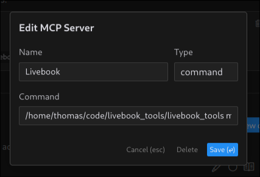
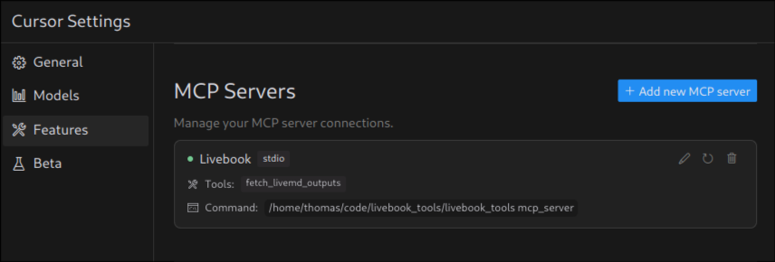

# LivebookTools

Livebook Tools is a CLI tool to give you superpowers while working with `.livemd` files.  
Its primary features are:  

  - **BYOE (Bring Your Own Editor)** - Sync your `.livemd` files to an open Livebook session so you can edit them in your AI powered code editor, like Cursor.
  - **MCP Server** - A simple model context protocol server for connecting AI coding agents to your Livebook sessions. More on this below.
  - **Run Livebooks from the CLI** - Convert your `.livemd` files to Elixir scripts and run them top to bottom as if they were a `.exs` script. Useful if you want to turn a livebook into a cron job.

## Installation

Livebook Tools is an Elixir escript.  
To install it, you can use the `mix escript.install` command.

```bash
mix escript.install github thmsmlr/livebook_tools
```

Once installed, ensure that the escript directory is on your path.  

```bash
# for normal elixir users
export PATH="$HOME/.mix/escripts:$PATH"

# for asdf elixir users
for escripts_dir in $(find "${ASDF_DATA_DIR:-$HOME/.asdf}/installs/elixir" -type d -name "escripts" 2>/dev/null); do
  export PATH="$escripts_dir:$PATH"
done
```

## Running Livebook

In order for Livebook tools to work properly, it needs to be able to connect to a running Livebook server using distributed Elixir.  
To do this will depend on how you are running Livebook.  
In its simplest form, all you need to do is add the two environment variables to your `~/.bashrc` or `~/.zshrc` file.

```bash
export LIVEBOOK_NODE="livebook@127.0.0.1"
export LIVEBOOK_COOKIE="some_secret_value"
```

Then when you run the Livebook tools or Livebook, both programs will discover these values and make sure that they can connect to each other.
If you're running using Livebook Desktop, then you may need to add these values to the `~/.livebookdesktop.sh` file.
For more information on Livebook Desktop, check out the [Livebook HexDocs](https://hexdocs.pm/livebook/readme.html#livebook-desktop).  


## Setting up MCP Server

The MCP Server is a simple [model context protocol](https://modelcontextprotocol.io/introduction) server that allows you to connect AI coding agents to your Livebook sessions.  
I have personally tested the implementation with [Cursor](https://www.cursor.com/), though it should work with any AI code editor that supports the MCP protocol.
The MCP server runs via STDIO, so all you have to do is tell Cursor to connect via the command and it'll auto discover the tools and connect them to it's coding agent.
For more information on MCP works with Cursor, check out the [Cursor MCP docs](https://docs.cursor.com/context/model-context-protocol).




